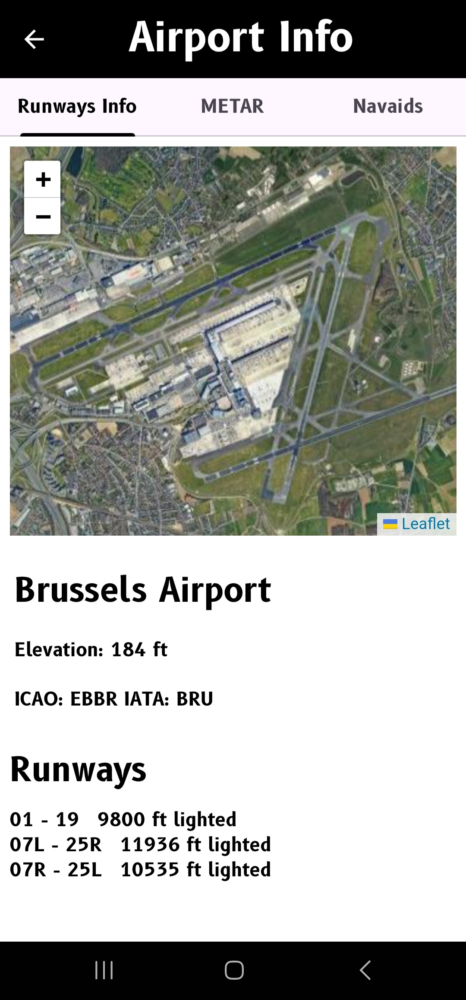
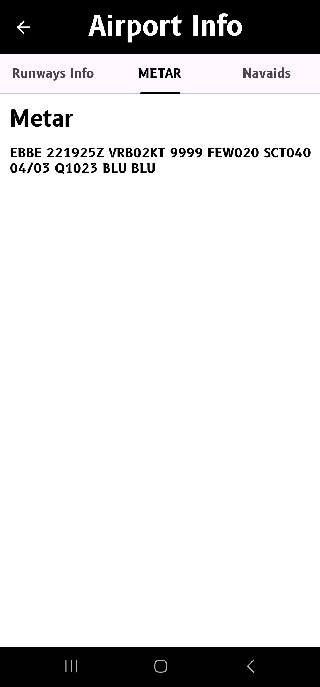
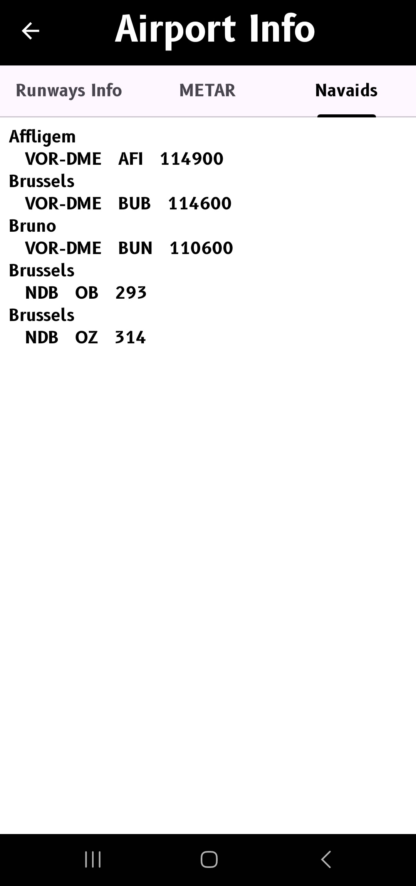

# Airport Explore

Airport Explore is a little Android app that allows you to search for information about an airport, such as the runways, the elevation, the metar, and even the navaids close to it.

## Screenshot

## API

I use two API's for this app.

Airport Info : https://airportdb.io/

Metar Info : https://www.checkwxapi.com/
